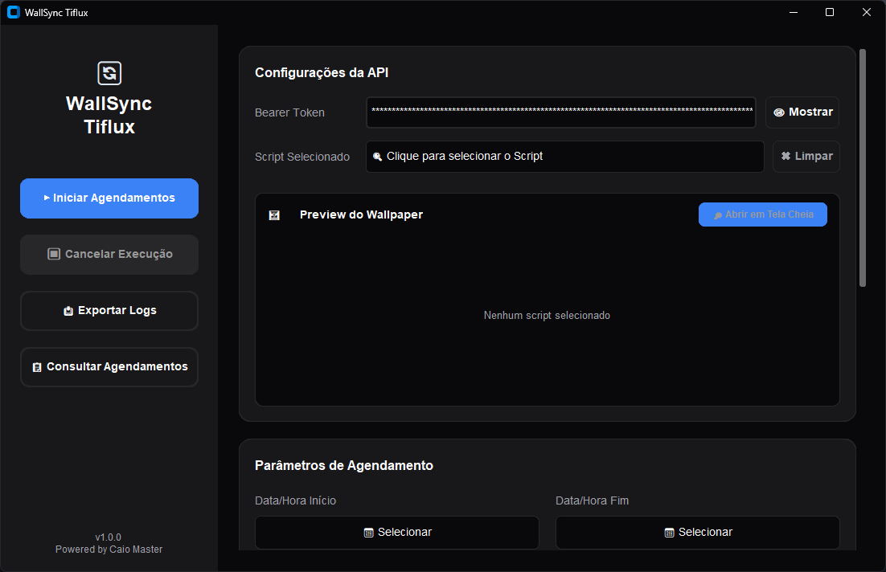
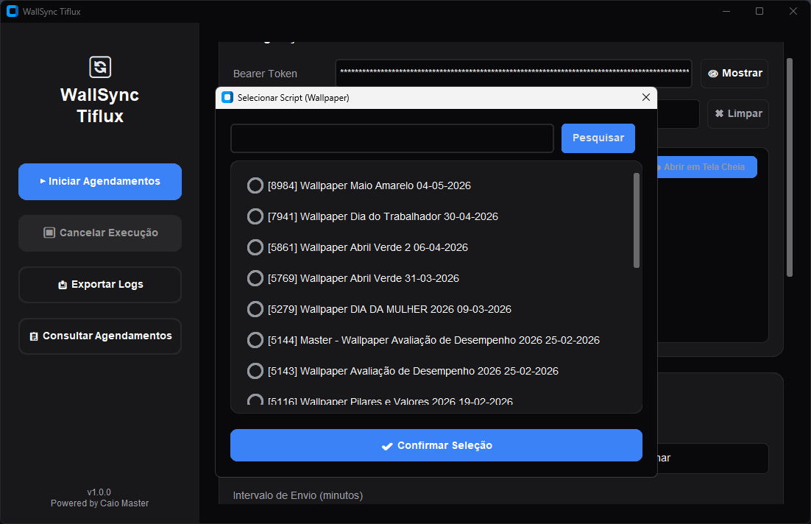
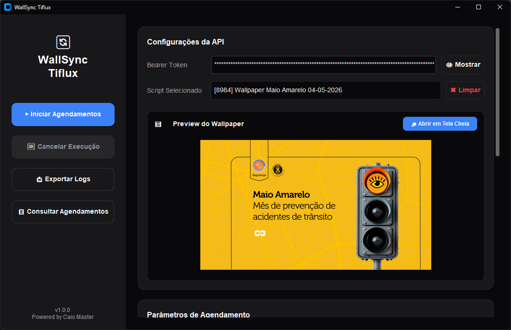
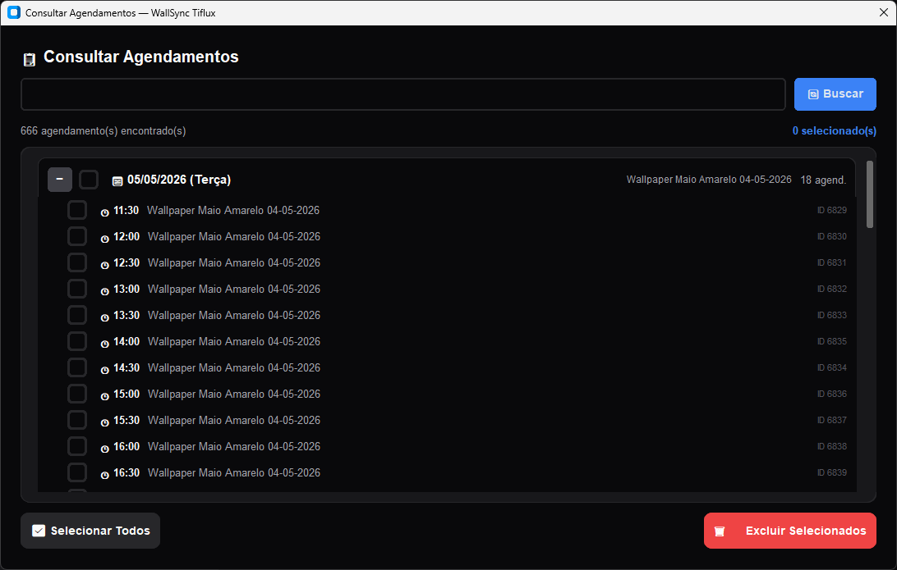
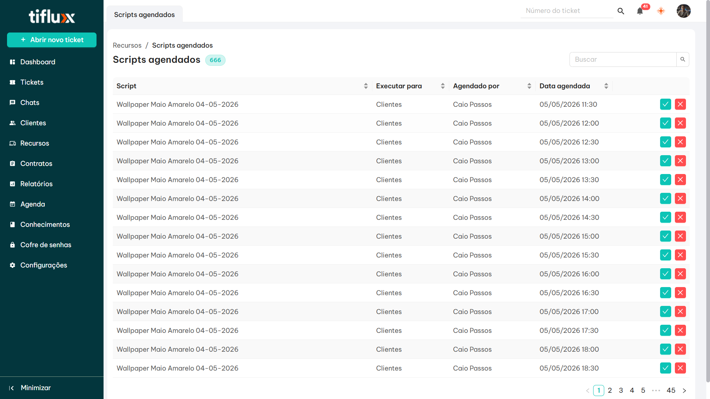

<p align="center">
  <h1 align="center">🖼️ WallSync Tiflux</h1>
  <p align="center">
    <strong>Automação inteligente de agendamento de wallpapers corporativos via API Tiflux RMM</strong>
  </p>
  <p align="center">
    
    
    
    
  </p>
</p>

---

## 📋 Sobre o Projeto

> **Projeto público e gratuito.** Se você usa o Tiflux e precisa manter wallpapers corporativos atualizados em múltiplas máquinas de forma automática e confiável, este projeto foi feito para você. Fique à vontade para usar, adaptar e contribuir.

O **WallSync Tiflux** é uma ferramenta desktop desenvolvida para **eliminar o processo manual** de agendamento de scripts de wallpaper na plataforma [Tiflux RMM](https://app.tiflux.com).

### O Problema

Na plataforma Tiflux, o agendamento de scripts de wallpaper é **extremamente limitado e manual**:

- Cada agendamento precisa ser criado **individualmente** pela interface web
- Para agendar um wallpaper em múltiplos horários ao longo do dia, é necessário repetir o processo manualmente para cada horário
- Não existe opção nativa de **agendamento em lote** ou por intervalo de tempo
- Agendar wallpapers para vários dias consecutivos com múltiplos horários é inviável manualmente (ex: 20 horários × 5 dias = 100 agendamentos manuais)

### A Solução

O WallSync Tiflux resolve esse problema utilizando a **API REST do Tiflux** para:

- ✅ **Agendar em lote** — Defina um período (ex: 05/05 a 09/05) e um intervalo (ex: a cada 30 min) e o sistema cria todos os agendamentos automaticamente
- ✅ **Cobertura garantida por execução periódica** — O script verifica se o wallpaper já está aplicado antes de qualquer ação; se já existir, encerra imediatamente (`exit 0`) sem custo. Isso permite agendar em múltiplos horários ao longo do dia: máquinas que estavam offline ou hibernando recebem o wallpaper na próxima execução disponível
- ✅ **Filtrar por expediente** — Configure horário de início e fim do expediente para não agendar fora do horário comercial
- ✅ **Selecionar dias da semana** — Escolha quais dias (Seg-Dom) devem receber os agendamentos
- ✅ **Ignorar horários passados** — Se a data inicial for hoje, horários que já passaram são automaticamente ignorados
- ✅ **Consultar e cancelar** — Visualize todos os agendamentos agrupados por dia e cancele seletivamente pelo WallSync ou diretamente pela plataforma Tiflux em **Recursos → Scripts agendados**
- ✅ **Preview do wallpaper** — Visualize o papel de parede que será aplicado antes de agendar
- ✅ **Envio paralelo** — Múltiplas requisições simultâneas para velocidade máxima
- ✅ **Barra de progresso** — Acompanhe o andamento em tempo real

---

## 🖥️ Screenshots

### Tela Principal — sem script selecionado



---

### Selecionando o Script de Wallpaper

Clique em "Clique para selecionar o Script" para abrir o modal de busca. Os scripts são carregados da API Tiflux com seus IDs e nomes.



---

### Preview do Wallpaper carregado

Após selecionar o script, o WallSync extrai a URL da imagem do conteúdo do script e exibe o preview automaticamente.



---

### Consultando e Cancelando Agendamentos

O modal **Consultar Agendamentos** exibe todos os agendamentos agrupados por dia, com horário e ID de cada execução. É possível selecionar individualmente ou usar "Selecionar Todos" para cancelar em lote via **Excluir Selecionados**.



---

### Resultado no Tiflux — Scripts Agendados

Após iniciar os agendamentos, a página **Recursos → Scripts agendados** no Tiflux mostra todos os horários criados em lote. No exemplo abaixo, 668 agendamentos do "Wallpaper Maio Amarelo 04-05-2026" foram criados automaticamente a cada 30 minutos ao longo do dia.



---

## 🚀 Instalação

### Pré-requisitos

- **Python 3.10+** instalado ([Download](https://www.python.org/downloads/))
- **Windows 10/11** (a ferramenta utiliza `pywinstyles` para estilização nativa)
- **Conta na Tiflux** com acesso à API RMM e permissão para gerenciar scripts

### Passo a Passo

1. **Clone o repositório:**
   ```bash
   git clone https://github.com/SEU_USUARIO/wallsync-tiflux.git
   cd wallsync-tiflux
   ```

2. **Instale as dependências:**
   ```bash
   pip install -r requirements.txt
   ```

3. **Execute a aplicação:**
   ```bash
   python main.py
   ```

   Ou simplesmente execute o `run.bat` (Windows).

### Dependências

| Pacote | Função |
|--------|--------|
| `customtkinter` | Framework de UI moderna para Python |
| `requests` | Comunicação HTTP com a API Tiflux |
| `tkcalendar` | Seletor de datas com calendário visual |
| `babel` | Internacionalização do calendário (pt_BR) |
| `pywinstyles` | Estilização da barra de título no Windows |
| `Pillow` | Processamento de imagens para preview do wallpaper |

---

## ⚙️ Configuração Inicial

### 1. Obter o Bearer Token da Tiflux

O WallSync suporta dois tipos de token — escolha o que melhor se adapta ao seu uso:

#### Token Temporário (via DevTools) — rápido, expira com a sessão

1. Acesse [https://app.tiflux.com](https://app.tiflux.com) e faça login
2. Abra o **DevTools** do navegador → `F12` → aba **Network**
3. Realize qualquer ação na plataforma (ex: abrir Scripts)
4. Clique em qualquer requisição à API → aba **Headers**
5. Copie o valor do header `Authorization: Bearer <TOKEN>`
6. Cole no campo **Bearer Token** do WallSync

> ⚠️ Este token expira quando a sessão do navegador encerra. Se o WallSync retornar `401 Unauthorized`, gere um novo token.

#### Token Fixo / Permanente (via API v2) — recomendado para uso contínuo

Tokens da API v2 **não expiram** — são revogados apenas manualmente ou ao inativar o usuário.

**Pré-requisito (feito pelo admin):** Acesse **Configurações → Usuários → Usuários**, localize o usuário e habilite **"API por usuário"**.

**Gerar o token (feito pelo próprio usuário):** Acesse **Configurações → Minha Conta → Sessões → Sessões API** e clique em **"Gerar novo token de sessão"**.

> ⚠️ O token é exibido **apenas uma vez** — copie e armazene imediatamente em local seguro.

📄 Consulte o passo a passo completo com screenshots em [`docs/api-tiflux.md`](docs/api-tiflux.md#autenticação).

---

> ⚠️ **Importante:** O token é salvo localmente em `config.json` e **nunca** é compartilhado ou enviado para terceiros. Certifique-se de não versionar este arquivo (já está no `.gitignore`).

### 2. Cadastrar o Script de Wallpaper na Tiflux

Antes de usar o WallSync, você precisa ter um **script de wallpaper cadastrado** na Tiflux:

1. Acesse **Configurações → Recursos → Scripts**
2. Clique em **+ Script** → tipo **PowerShell (.ps1)**, timeout **160s**, executar como usuário **OFF**
3. Cole o conteúdo do template e atualize `$desiredWallpaperName` e `$wallpaperUrl`

> 📄 Consulte o template completo e o passo a passo com screenshots em [`docs/script-wallpaper.md`](docs/script-wallpaper.md).

---

## 📖 Como Usar

### Agendar Wallpapers

1. **Insira o Bearer Token** no campo de autenticação
2. **Selecione o Script** — Clique em "Clique para selecionar o Script" e busque o script de wallpaper desejado
3. **Visualize o Preview** — A miniatura do wallpaper será exibida automaticamente
4. **Configure as datas** — Selecione Data/Hora de Início e Fim
5. **Defina o intervalo** — Ex: `30` para agendar a cada 30 minutos
6. **Configure o expediente** (opcional) — Marque "Usar horário de expediente" e defina o horário comercial
7. **Selecione os dias** — Marque os dias da semana desejados
8. **Clique em "▶ Iniciar Agendamentos"** — Acompanhe o progresso pela barra e logs

### Consultar e Cancelar Agendamentos

Os agendamentos podem ser cancelados de duas formas:

**Pelo WallSync (recomendado para cancelamento em lote):**

1. Clique em **"📋 Consultar Agendamentos"** na sidebar
2. Os agendamentos são carregados e **agrupados por dia**
3. Clique em **"+"** para expandir os horários de cada dia
4. Selecione individualmente ou use **"Selecionar Todos"**
5. Clique em **"🗑️ Excluir Selecionados"** para cancelar via API

**Pelo Tiflux (cancelamento individual ou pontual):**

Acesse **Recursos → Scripts agendados** na plataforma Tiflux. A listagem mostra todos os agendamentos com script, destino, responsável e data/hora. Clique no botão ✕ vermelho ao lado do agendamento para cancelá-lo individualmente.

> Para mais detalhes, consulte [`docs/script-wallpaper.md`](docs/script-wallpaper.md#cancelamento-de-agendamentos).

---

## 📂 Estrutura do Projeto

```
wallsync-tiflux/
├── main.py                 # Aplicação principal (GUI + lógica)
├── requirements.txt        # Dependências Python
├── config.example.json     # Exemplo de configuração
├── run.bat                 # Script de execução rápida (Windows)
├── .gitignore              # Arquivos ignorados pelo Git
├── README.md               # Este arquivo
└── docs/
    ├── arquitetura.md      # Arquitetura técnica da aplicação
    ├── api-tiflux.md       # Documentação da API Tiflux utilizada
    ├── script-wallpaper.md # Template do script de wallpaper
    └── changelog.md        # Histórico de alterações
```

---

## 📚 Documentação

| Documento | Descrição |
|-----------|-----------|
| [`docs/arquitetura.md`](docs/arquitetura.md) | Arquitetura técnica, componentes e fluxo de dados |
| [`docs/api-tiflux.md`](docs/api-tiflux.md) | Endpoints da API Tiflux utilizados (GET, POST, PUT) |
| [`docs/script-wallpaper.md`](docs/script-wallpaper.md) | Template do script PowerShell de wallpaper |
| [`docs/changelog.md`](docs/changelog.md) | Histórico de versões e alterações |

---

## 🛡️ Segurança

- O **Bearer Token** é armazenado apenas localmente no `config.json`
- O arquivo `config.json` está no `.gitignore` — **nunca** será commitado
- A comunicação com a API é feita via **HTTPS**
- Nenhum dado é enviado para servidores de terceiros

---

## 🤝 Contribuindo

1. Faça um fork do projeto
2. Crie uma branch para sua feature (`git checkout -b feature/minha-feature`)
3. Commit suas alterações (`git commit -m 'feat: minha feature'`)
4. Push para a branch (`git push origin feature/minha-feature`)
5. Abra um Pull Request

---

## 📝 Licença

Este projeto é público e de uso livre. Sinta-se à vontade para usar, modificar e distribuir.

---

## Autor

<p>
  <a href="https://www.youtube.com/@heyca1o">
    
  </a>
  <a href="https://www.youtube.com/@DroidTechDicasTutoriais100K">
    
  </a>
  <a href="https://www.instagram.com/heyca1o/">
    
  </a>
</p>

---

<p align="center">
  <strong>WallSync Tiflux v1.0.0</strong><br>
  Desenvolvido por <strong>Caio Passos</strong><br>
  <a href="https://www.youtube.com/@heyca1o"></a>
  <a href="https://www.youtube.com/@DroidTechDicasTutoriais100K"></a>
  <a href="https://www.instagram.com/heyca1o/"></a><br>
  Powered by Python + CustomTkinter + API Tiflux RMM
</p>
