# 🔌 API Tiflux RMM — Endpoints Utilizados

Este documento detalha todos os endpoints da API Tiflux RMM utilizados pelo WallSync Tiflux.

## Base URL

```
https://app.tiflux.com/equipment/rmm
```

## Autenticação

Todas as requisições exigem o header de autenticação:

```http
Authorization: Bearer <TOKEN>
Content-Type: application/json
Accept: application/json
```

O WallSync suporta dois tipos de token — escolha o que melhor se adapta ao seu ambiente:

---

### Token Temporário (via DevTools)

O token de sessão da interface web é válido enquanto você estiver logado. É a forma mais rápida para uso pontual.

**Como obter:**

1. Acesse [https://app.tiflux.com](https://app.tiflux.com) e faça login
2. Abra o **DevTools** do navegador → `F12` → aba **Network**
3. Realize qualquer ação na plataforma (ex: abrir Scripts)
4. Clique em qualquer requisição à API → aba **Headers**
5. Copie o valor do header `Authorization: Bearer <TOKEN>`
6. Cole no campo **Bearer Token** do WallSync

> ⚠️ Este token expira quando a sessão do navegador encerra. Se o WallSync começar a retornar `401`, gere um novo token.

---

### Token Fixo / Permanente (via API v2)

Tokens da API v2 **não expiram automaticamente** — são revogados apenas manualmente ou ao inativar o usuário. Ideal para uso contínuo do WallSync.

**Pré-requisito — Atribuir licença de API ao usuário (feito pelo admin):**

Acesse **Configurações → Usuários → Usuários**, localize o usuário e habilite a opção **"API por usuário"**.

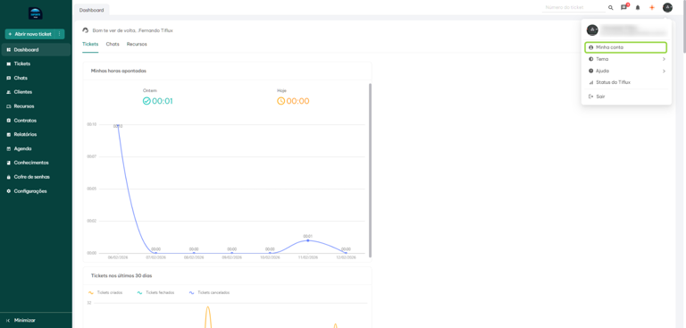

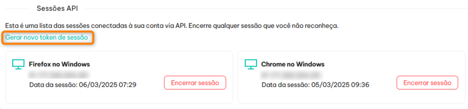

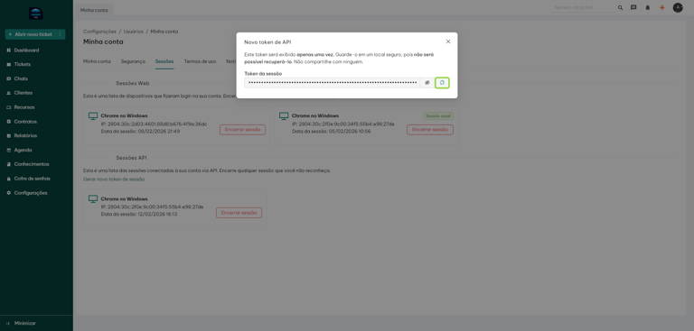

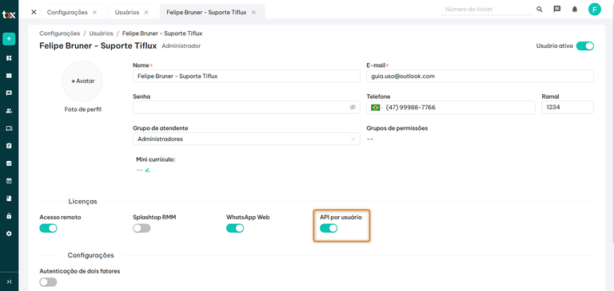

---

**Gerar o token — feito pelo próprio usuário:**

Acesse **Configurações → Minha Conta → Sessões**, localize a seção **"Sessões API"** e clique em **"Gerar novo token de sessão"**.

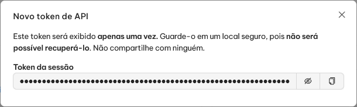

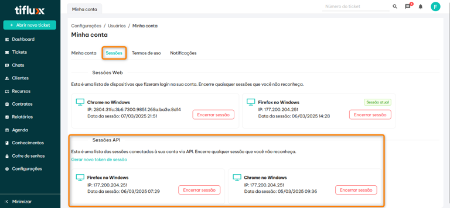

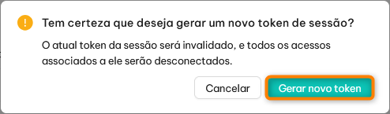

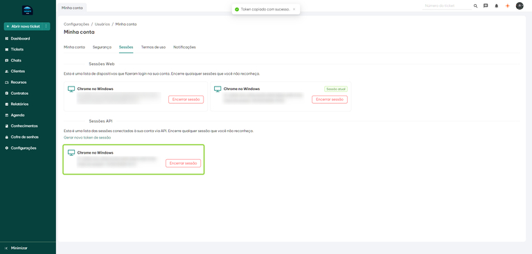

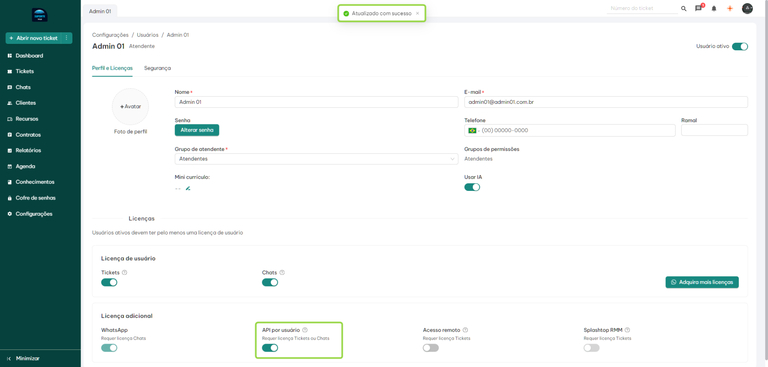

> ⚠️ **O token é exibido apenas uma vez.** Copie e armazene em local seguro imediatamente após a geração.

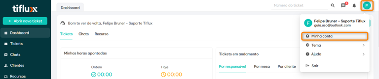

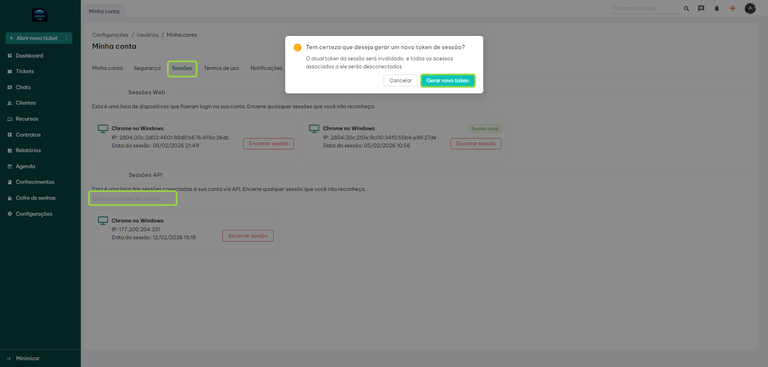

---

### Comparativo

| | Token Temporário | Token Fixo (API v2) |
|---|---|---|
| **Como obter** | DevTools (F12) | Configurações → Minha Conta → Sessões |
| **Expiração** | Quando a sessão encerra | Não expira (revogação manual) |
| **Ideal para** | Uso pontual / teste | Uso contínuo do WallSync |
| **Requer admin** | Não | Sim (atribuir licença uma vez) |

---

## Endpoints

### 1. Listar Scripts Cadastrados

Retorna a lista de scripts RMM cadastrados na organização.

```http
GET /scripts?page={page}&search={search}&limit={limit}&run_type=execution
```

**Parâmetros:**

| Parâmetro | Tipo | Obrigatório | Descrição |
|-----------|------|-------------|-----------|
| `page` | int | Sim | Número da página (1-indexed) |
| `search` | string | Não | Termo de busca por nome |
| `limit` | int | Sim | Itens por página (máx. 15) |
| `run_type` | string | Sim | Tipo de execução (`execution`) |

**Resposta (200):**
```json
{
    "total": 42,
    "data": [
        {
            "id": 8984,
            "name": "Wallpaper Maio Amarelo 04-05-2026",
            "description": "Script de papel de parede",
            "operating_system": "windows",
            "run_type": "execution"
        }
    ]
}
```

---

### 2. Obter Detalhes do Script (com conteúdo)

Retorna os detalhes completos de um script, incluindo o campo `content` com o código fonte.

```http
GET /scripts/{id}
```

**Resposta (200):**
```json
{
    "id": 8984,
    "name": "Wallpaper Maio Amarelo 04-05-2026",
    "content": "$webClient = New-Object System.Net.WebClient\n$webClient.DownloadFile(\"https://exemplo.com/wallpaper.png\", ...)",
    "operating_system": "windows",
    "run_type": "execution"
}
```

> **Uso no WallSync:** O campo `content` é parseado para extrair a URL da imagem do wallpaper e exibir o preview na interface.

---

### 3. Listar Agendamentos (Batch Script Actions)

Retorna os agendamentos de scripts existentes, paginados.

```http
GET /batch_script_actions?limit={limit}&page={page}&search={search}&order_by=
```

**Parâmetros:**

| Parâmetro | Tipo | Obrigatório | Descrição |
|-----------|------|-------------|-----------|
| `limit` | int | Sim | Itens por página (**máximo 15** — limitação da API) |
| `page` | int | Sim | Número da página |
| `search` | string | Não | Filtro por nome do script |
| `order_by` | string | Não | Campo de ordenação |

**Resposta (200):**
```json
{
    "total": 244,
    "data": [
        {
            "id": 6490,
            "execution_type": "clients",
            "operating_system": "windows",
            "scheduled_date": "2026-05-04T07:00:02.655-03:00",
            "script_name": "Wallpaper Maio Amarelo 04-05-2026",
            "user_name": "Caio Passos"
        }
    ]
}
```

> **⚠️ Paginação:** A API da Tiflux limita a **15 itens por requisição**. Para carregar todos os agendamentos, o WallSync faz requisições paginadas até atingir o `total`.

---

### 4. Criar Agendamento

Cria um novo agendamento de execução de script.

```http
POST /batch_script_actions
```

**Body:**
```json
{
    "operating_system": "windows",
    "script_id": 8984,
    "scheduled_date": "2026-05-05T08:00:00.000-03:00",
    "execution_type": "clients",
    "client_ids": []
}
```

**Campos:**

| Campo | Tipo | Descrição |
|-------|------|-----------|
| `operating_system` | string | Sistema operacional alvo (`windows`) |
| `script_id` | int | ID do script a ser executado |
| `scheduled_date` | string | Data/hora no formato ISO 8601 com offset `-03:00` |
| `execution_type` | string | Tipo de execução (`clients`) |
| `client_ids` | array | IDs dos clientes (vazio = todos) |

**Resposta (201):** Agendamento criado com sucesso.

> **Formato de data:** O WallSync gera datas no formato `YYYY-MM-DDTHH:MM:SS.000-03:00` para compatibilidade com o fuso horário de Brasília.

---

### 5. Cancelar Agendamento

Cancela um agendamento existente (muda o status para `cancelled`).

```http
PUT /batch_script_actions/{id}/cancel_scripts
```

**Resposta (200):**
```json
{
    "status": "cancelled",
    "finished_date": "2026-05-03T16:56:23.829-03:00",
    "id": 6508,
    "organization_id": 8011,
    "script_id": 8984,
    "user_id": 39536,
    "operating_system": "windows",
    "execution_type": "clients",
    "scheduled_date": "2026-05-04T16:00:00.000-03:00"
}
```

> **Observação:** O endpoint de cancelamento utiliza `PUT` (não `DELETE`). Isso foi descoberto inspecionando o comportamento da interface web da Tiflux via DevTools.

---

## Códigos de Status

| Código | Significado | Contexto |
|--------|-------------|----------|
| `200` | Sucesso | GET, PUT (cancelar) |
| `201` | Criado | POST (novo agendamento) |
| `204` | Sem conteúdo | Sucesso sem body |
| `401` | Não autorizado | Token inválido/expirado |
| `500` | Erro interno | Bug da API (ocorre no DELETE, mas a ação é processada) |

---

## Rate Limiting

A API da Tiflux não documenta limites de taxa explícitos, porém o WallSync adota as seguintes precauções:

- **Máximo 5 workers paralelos** no envio de agendamentos
- **Timeout de 30s** por requisição
- **3 tentativas automáticas** com intervalo de 2s em caso de timeout
- **Debounce de 500ms** na busca de scripts para evitar requisições excessivas
