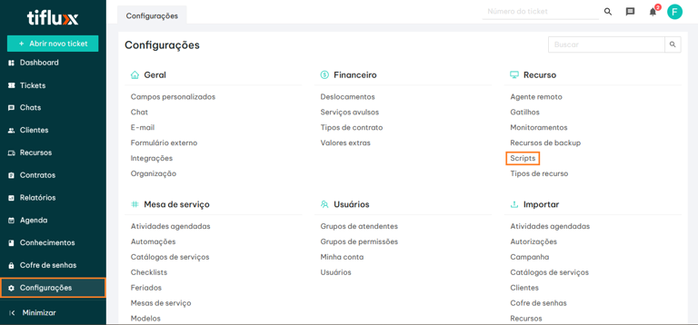
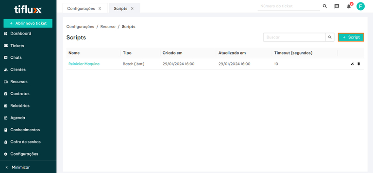
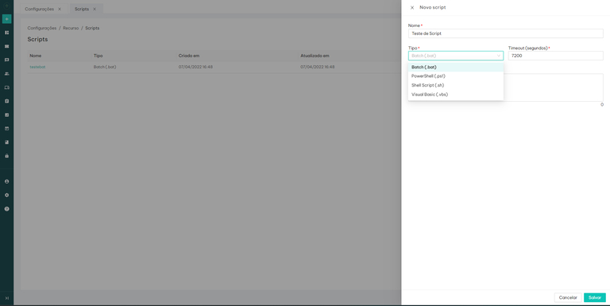
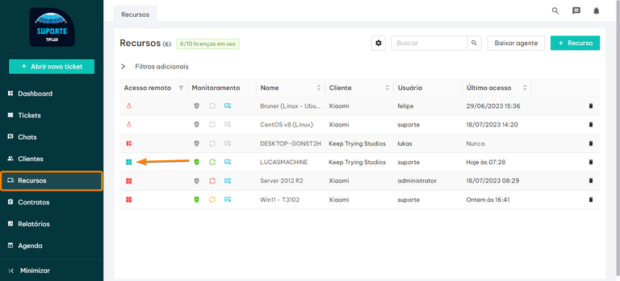
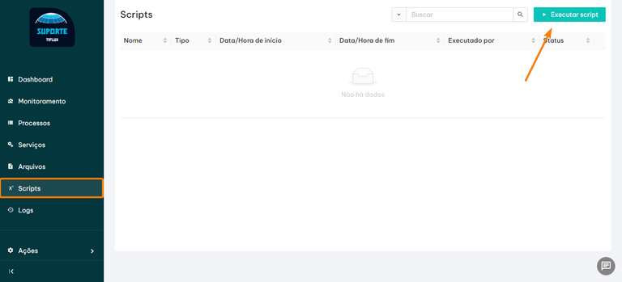
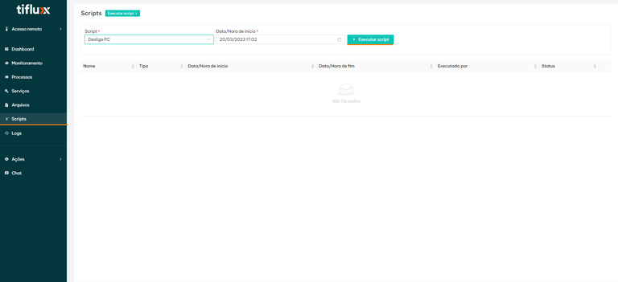
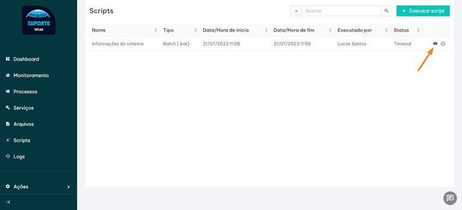

# 🖼️ Script de Wallpaper — Template PowerShell

Este documento descreve o script PowerShell de produção utilizado na Tiflux para aplicar wallpapers nos equipamentos gerenciados via agente remoto.

## Onde Cadastrar na Tiflux

### Passo 1 — Acessar a tela de Scripts

Acesse **Configurações → Recursos → Scripts** (URL: `https://app.tiflux.com/v/configurations/scripts`).



---

### Passo 2 — Criar novo script

Na aba **Execução**, clique em **+ Script** no canto superior direito.



---

### Passo 3 — Preencher o formulário

Preencha os campos conforme abaixo e cole o conteúdo do script:



| Campo | Valor |
|-------|-------|
| **Nome** | `Wallpaper [Tema da Campanha] DD-MM-AAAA` |
| **Tipo** | `PowerShell (.ps1)` |
| **Timeout (segundos)** | `160` |
| **Executar como usuário** | **OFF** (roda como SYSTEM via agente) |

> O timeout de 160s é necessário porque o script compila um `.exe` em tempo de execução e aguarda até 40s pela Scheduled Task + 15s internos ao EXE.

Exemplo real do formulário preenchido para o wallpaper de Maio Amarelo 2026:


> 💡 Salve o screenshot do formulário preenchido em `docs/images/form-wallpaper-maio-amarelo.png` para manter este registro atualizado.

---

### Passo 4 — Lista de scripts cadastrados

Após salvar, o script aparece na lista com nome, tipo, data de criação e timeout:


> 💡 Salve o screenshot da lista em `docs/images/lista-scripts-wallpaper.png`.

## Convenção de Nomenclatura

- **Script na Tiflux:** `Wallpaper [Campanha] DD-MM-AAAA`
- **Nome do arquivo de imagem (variável `$desiredWallpaperName`):** `WP-[CAMPANHA]-DD-MM-AAAA`

### Exemplos:
- `Wallpaper Maio Amarelo 04-05-2026` → `WP- MAIOAMARELO-04-05-2026`
- `Wallpaper Dia das Mães 11-05-2026` → `WP-DIASDASMAES-11-05-2026`
- `Wallpaper Segurança Digital 15-06-2026` → `WP-SEGURANCADIGITAL-15-06-2026`

---

## O que Alterar a Cada Nova Campanha

Do template base, **apenas 3 coisas mudam**:

```powershell
# 1. Comentário no topo (linha 1 — identificação visual)
Wallpaper [Nome da Campanha] DD-MM-AAAA

# 2. Nome do arquivo da imagem (sem extensão)
$desiredWallpaperName = "WP-NOMEDACAMPANHA-DD-MM-AAAA"

# 3. URL de download da imagem
$wallpaperUrl = "https://seusite.com/caminho/para/WP-NOMEDACAMPANHA-DD-MM-AAAA.png"
```

Todo o restante do script permanece idêntico entre campanhas.

---

## Template Completo (Script de Produção)

```powershell
Wallpaper [Nome da Campanha] DD-MM-AAAA
# =============================================================================
# Set-Wallpaper.ps1
# Executa como SYSTEM/Admin (Intune, SCCM, agente de helpdesk, etc.)
# Compativel com maquinas em Dominio e WORKGROUP
#
# A Scheduled Task executa o .exe diretamente, sem powershell.exe intermediario.
# Isso elimina problemas de politica de execucao que impediam o PS1 de rodar.
# =============================================================================

# -----------------------------------------------------------------------------
# Variaveis — ALTERAR A CADA CAMPANHA
# -----------------------------------------------------------------------------
$tempDir              = "C:\Windows\Temp"
$desiredWallpaperName = "WP-NOMEDACAMPANHA-DD-MM-AAAA"
$wallpaperPath        = "C:\Windows\Web\Wallpaper\Windows\$desiredWallpaperName.png"
$wallpaperUrl         = "https://seusite.com/caminho/para/WP-NOMEDACAMPANHA-DD-MM-AAAA.png"
$taskName             = "ApplyWallpaperNow_$desiredWallpaperName"
$exePath              = "$tempDir\SetWallpaperNow.exe"
$batScriptPath        = "$tempDir\SetWallpaper.bat"
$logPath              = "$tempDir\ApplyWallpaperNow.log"

# -----------------------------------------------------------------------------
# 1. Verifica se o wallpaper ja existe
# -----------------------------------------------------------------------------
if (Test-Path $wallpaperPath) {
    Write-Host "O papel de parede ja se encontra aplicado."
    exit 0
}

# -----------------------------------------------------------------------------
# 2. Cria diretorio de destino se nao existir
# -----------------------------------------------------------------------------
$wallpaperDir = Split-Path $wallpaperPath -Parent
if (-not (Test-Path $wallpaperDir)) {
    New-Item -ItemType Directory -Path $wallpaperDir -Force | Out-Null
}

# -----------------------------------------------------------------------------
# 3. Download do wallpaper
# -----------------------------------------------------------------------------
try {
    [Net.ServicePointManager]::SecurityProtocol = [Net.SecurityProtocolType]::Tls12
    $webClient = New-Object System.Net.WebClient
    $webClient.DownloadFile($wallpaperUrl, $wallpaperPath)
    Write-Host "Download concluido: $wallpaperPath"
} catch {
    Write-Host "Erro no download: $_"
    exit 1
}

# -----------------------------------------------------------------------------
# 4. Configura permissoes
# -----------------------------------------------------------------------------
icacls $wallpaperPath /grant "*S-1-5-32-545:(RX)" /T /C | Out-Null
Write-Host "Permissoes configuradas."

# -----------------------------------------------------------------------------
# 5. Configura registro HKLM (PersonalizationCSP)
# -----------------------------------------------------------------------------
$registryPath = "HKLM:\SOFTWARE\Microsoft\Windows\CurrentVersion\PersonalizationCSP"
if (-not (Test-Path $registryPath)) {
    New-Item -Path $registryPath -Force | Out-Null
}
@{
    "LockScreenImagePath" = $wallpaperPath
    "LockScreenImageUrl"  = $wallpaperPath
    "DesktopImagePath"    = $wallpaperPath
    "DesktopImageUrl"     = $wallpaperPath
}.GetEnumerator() | ForEach-Object {
    Set-ItemProperty -Path $registryPath -Name $_.Key -Value $_.Value -Type String -Force
}
Write-Host "Registro HKLM configurado."

# -----------------------------------------------------------------------------
# 6. Cria BAT do Active Setup (fallback para proximo login)
# -----------------------------------------------------------------------------
$userScript = @"
reg add "HKCU\Control Panel\Desktop" /v Wallpaper /t REG_SZ /d "$wallpaperPath" /f
reg add "HKCU\Control Panel\Desktop" /v WallpaperStyle /t REG_SZ /d 10 /f
reg add "HKCU\Control Panel\Desktop" /v TileWallpaper /t REG_SZ /d 0 /f
reg add "HKCU\Control Panel\Desktop" /v JPEGImportQuality /t REG_DWORD /d 100 /f
RUNDLL32.EXE USER32.DLL,UpdatePerUserSystemParameters ,1 ,True
"@
[System.IO.File]::WriteAllText($batScriptPath, $userScript, [System.Text.Encoding]::ASCII)

# -----------------------------------------------------------------------------
# 7. Active Setup
# -----------------------------------------------------------------------------
$activeSetupPath = "HKLM:\SOFTWARE\Microsoft\Active Setup\Installed Components\{DE14059B-24A1-46A5-9966-C523094DA9F1}"
if (-not (Test-Path $activeSetupPath)) {
    New-Item -Path $activeSetupPath -Force | Out-Null
}
Set-ItemProperty -Path $activeSetupPath -Name "(Default)" -Value "Desktop Wallpaper Setup" -Type String
Set-ItemProperty -Path $activeSetupPath -Name "Version"   -Value "1,0,0,0"                 -Type String
Set-ItemProperty -Path $activeSetupPath -Name "StubPath"  -Value $batScriptPath             -Type String
Write-Host "Active Setup configurado."

# -----------------------------------------------------------------------------
# 8. Compila helper .exe em C# (roda na sessao do usuario via Scheduled Task)
# -----------------------------------------------------------------------------
$csharpSource = @"
using System;
using System.IO;
using System.Runtime.InteropServices;
using Microsoft.Win32;

class SetWallpaper {

    [DllImport("user32.dll", CharSet = CharSet.Auto)]
    static extern int SystemParametersInfo(int uAction, int uParam, string lpvParam, int fuWinIni);

    [DllImport("user32.dll", CharSet = CharSet.Auto)]
    static extern IntPtr SendMessageTimeout(
        IntPtr hWnd, uint Msg, UIntPtr wParam,
        string lParam, uint fuFlags, uint uTimeout, out UIntPtr lpdwResult);

    const int  SPI_SETDESKWALLPAPER = 20;
    const int  SPIF_UPDATEINIFILE   = 0x01;
    const int  SPIF_SENDCHANGE      = 0x02;
    const uint WM_SETTINGCHANGE     = 0x001A;
    const uint SMTO_ABORTIFHUNG     = 0x0002;
    static readonly IntPtr HWND_BROADCAST = new IntPtr(0xffff);

    static string logPath = @"C:\Windows\Temp\ApplyWallpaperNow.log";

    static void Log(string msg) {
        try {
            File.AppendAllText(logPath,
                "[" + DateTime.Now.ToString("HH:mm:ss") + "] " + msg + Environment.NewLine);
        } catch {}
    }

    static void Apply(string path) {
        Log("Chamando SystemParametersInfo com: " + path);
        int r1 = SystemParametersInfo(SPI_SETDESKWALLPAPER, 0, path, SPIF_UPDATEINIFILE | SPIF_SENDCHANGE);
        Log("SystemParametersInfo retornou: " + r1);

        UIntPtr result;
        Log("Chamando SendMessageTimeout WM_SETTINGCHANGE...");
        SendMessageTimeout(HWND_BROADCAST, WM_SETTINGCHANGE, UIntPtr.Zero,
            "Environment", SMTO_ABORTIFHUNG, 5000, out result);
        Log("SendMessageTimeout concluido.");
    }

    static void Main(string[] args) {
        if (args.Length == 0) { Log("ERRO: nenhum argumento recebido."); return; }
        string path = args[0];

        Log("==== SetWallpaperNow.exe iniciado ====");
        Log("Usuario: " + Environment.UserName);
        Log("Caminho: " + path);

        if (!File.Exists(path)) { Log("ERRO: arquivo nao encontrado: " + path); return; }

        try {
            using (RegistryKey key = Registry.CurrentUser.OpenSubKey(@"Control Panel\Desktop", true)) {
                if (key != null) {
                    key.SetValue("Wallpaper", path);
                    key.SetValue("WallpaperStyle", "10");
                    key.SetValue("TileWallpaper", "0");
                    key.SetValue("JPEGImportQuality", 100, RegistryValueKind.DWord);
                    Log("OK - Registro HKCU gravado.");
                }
            }
        } catch (Exception ex) { Log("ERRO ao gravar registro: " + ex.Message); }

        Log("--- Aplicacao 1 de 2 ---");
        Apply(path);

        Log("Aguardando 15 segundos...");
        System.Threading.Thread.Sleep(15000);

        Log("--- Aplicacao 2 de 2 ---");
        Apply(path);

        Log("==== Concluido ====");
    }
}
"@

$cscPath = @(
    "$env:SystemRoot\Microsoft.NET\Framework64\v4.0.30319\csc.exe",
    "$env:SystemRoot\Microsoft.NET\Framework\v4.0.30319\csc.exe"
) | Where-Object { Test-Path $_ } | Select-Object -First 1

$useExe = $false
if ($cscPath) {
    $csSrcPath = "$tempDir\SetWallpaperNow.cs"
    [System.IO.File]::WriteAllText($csSrcPath, $csharpSource, [System.Text.Encoding]::UTF8)
    & $cscPath /nologo /target:winexe /out:"$exePath" "$csSrcPath" 2>&1 | Out-Null
    if (Test-Path $exePath) {
        icacls $exePath /grant "*S-1-5-32-545:(RX)" | Out-Null
        Write-Host "Compilacao do helper concluida: $exePath"
        $useExe = $true
    } else {
        Write-Host "AVISO: Falha na compilacao. Usando fallback RUNDLL32."
    }
} else {
    Write-Host "AVISO: CSC nao encontrado. Usando fallback RUNDLL32."
}

# -----------------------------------------------------------------------------
# 9. gpupdate
# -----------------------------------------------------------------------------
Start-Process "gpupdate" -ArgumentList "/force" -Wait -NoNewWindow

# -----------------------------------------------------------------------------
# 10. Remove log anterior
# -----------------------------------------------------------------------------
if (Test-Path $logPath) { Remove-Item $logPath -Force }

# -----------------------------------------------------------------------------
# 11. Detecta sessoes ativas — 3 metodos em cascata
# -----------------------------------------------------------------------------
$activeSessions = @()
Write-Host "Detectando sessoes ativas..."

# Metodo 1: query session
try {
    $queryOutput = & query session 2>$null
    if ($queryOutput) {
        $queryOutput | Select-Object -Skip 1 | ForEach-Object {
            $line = $_ -replace '>', ' '
            if ($line -match '^\s*\S+\s+(\S+)\s+(\d+)\s+(Active|Ativo)\s*') {
                $username = $Matches[1]
                if ($username -notin @('services','console','rdp-tcp') -and $username -notmatch '^\d+$') {
                    if ($activeSessions -notcontains $username) {
                        $activeSessions += $username
                        Write-Host "  [query session] Sessao ativa: $username"
                    }
                }
            }
        }
    }
} catch { Write-Host "  [query session] falhou: $_" }

# Metodo 2: explorer.exe
if ($activeSessions.Count -eq 0) {
    try {
        Get-WmiObject Win32_Process -Filter "Name='explorer.exe'" | ForEach-Object {
            $owner = $_.GetOwner()
            if ($owner.ReturnValue -eq 0 -and $owner.User) {
                if ($activeSessions -notcontains $owner.User) {
                    $activeSessions += $owner.User
                    Write-Host "  [explorer.exe] Sessao ativa: $($owner.User)"
                }
            }
        }
    } catch { Write-Host "  [Metodo 2] falhou: $_" }
}

# Metodo 3: Win32_ComputerSystem
if ($activeSessions.Count -eq 0) {
    try {
        $primaryUser = (Get-WmiObject Win32_ComputerSystem).UserName
        if ($primaryUser) {
            $activeSessions += $primaryUser.Split("\")[-1]
            Write-Host "  [Win32_ComputerSystem] Usuario: $primaryUser"
        }
    } catch { Write-Host "  [Metodo 3] falhou: $_" }
}

# -----------------------------------------------------------------------------
# 12. Resolve SID
# -----------------------------------------------------------------------------
$sessionObjects = @()
foreach ($username in $activeSessions) {
    $cleanName = $username.Split("\")[-1]
    $sid = $null
    try {
        $sid = (New-Object System.Security.Principal.NTAccount($cleanName)).Translate(
            [System.Security.Principal.SecurityIdentifier]).Value
        Write-Host "  SID resolvido para $cleanName : $sid"
    } catch {
        try {
            $account = Get-WmiObject Win32_Account -Filter "Name='$cleanName'" -ErrorAction SilentlyContinue
            if ($account -and $account.SID) { $sid = $account.SID }
            Write-Host "  SID (WMI) resolvido para $cleanName : $sid"
        } catch {}
    }
    if ($sid) {
        $sessionObjects += [PSCustomObject]@{ Username = $cleanName; SID = $sid }
    } else {
        Write-Host "  AVISO: nao foi possivel resolver SID para $cleanName - sera ignorado."
    }
}

# -----------------------------------------------------------------------------
# 13. Scheduled Task executando o EXE diretamente (sem powershell.exe)
# -----------------------------------------------------------------------------
if ($sessionObjects.Count -eq 0) {
    Write-Host "Nenhuma sessao ativa. Wallpaper sera aplicado no proximo login via Active Setup."
} else {
    foreach ($session in $sessionObjects) {
        $userTaskName = "${taskName}_$($session.Username)"
        Write-Host "Aplicando wallpaper para: $($session.Username) (SID: $($session.SID))"

        try {
            Unregister-ScheduledTask -TaskName $userTaskName -Confirm:$false -ErrorAction SilentlyContinue

            if ($useExe) {
                $taskAction = New-ScheduledTaskAction `
                    -Execute $exePath `
                    -Argument "`"$wallpaperPath`""
            } else {
                $taskAction = New-ScheduledTaskAction `
                    -Execute "cmd.exe" `
                    -Argument "/c `"$batScriptPath`""
            }

            $taskPrincipal = New-ScheduledTaskPrincipal `
                -UserId $session.SID `
                -LogonType Interactive `
                -RunLevel Limited

            Register-ScheduledTask `
                -TaskName $userTaskName `
                -Action $taskAction `
                -Principal $taskPrincipal `
                -Force | Out-Null

            Start-ScheduledTask -TaskName $userTaskName

            Write-Host "  -> Aguardando 40 segundos..."
            Start-Sleep -Seconds 40

            Unregister-ScheduledTask -TaskName $userTaskName -Confirm:$false -ErrorAction SilentlyContinue
            Write-Host "  -> OK: wallpaper aplicado para $($session.Username)"

        } catch {
            Write-Host "  -> ERRO: $_"
        }
    }
}

# -----------------------------------------------------------------------------
# 14. Exibe log gravado pelo EXE
# -----------------------------------------------------------------------------
Write-Host ""
Write-Host "============================================================"
Write-Host "LOG DO HELPER EXE:"
Write-Host "============================================================"
if (Test-Path $logPath) {
    Get-Content $logPath | ForEach-Object { Write-Host "  $_" }
} else {
    Write-Host "  ATENCAO: log nao foi criado."
    Write-Host "  Isso indica que o EXE nao foi executado pela Scheduled Task."
}
Write-Host "============================================================"
Write-Host "Configuracao concluida."
Write-Host "============================================================"
```

---

## Como Executar o Script nos Dispositivos

Após cadastrar o script, a execução ocorre pelo dashboard do agente remoto do dispositivo.

### Passo 1 — Acessar o agente do dispositivo

Em **Recursos**, clique no ícone do sistema operacional do dispositivo para abrir seu dashboard.



---

### Passo 2 — Abrir a aba Scripts e executar

No dashboard do agente, acesse a seção **Scripts** e clique em **Executar Script**.



---

### Passo 3 — Selecionar script e agendar

Escolha o script cadastrado, defina a data/hora e confirme.



> Para agendar em múltiplos horários/dispositivos de forma automática, use o **WallSync Tiflux** (`main.py`).

---

### Passo 4 — Histórico de execuções

Após executar, o sistema mantém um histórico com status de cada execução.



---

## Estratégia de Cobertura — Execução Periódica

O script é projetado para ser **executado repetidamente ao longo do dia** (ex: a cada 30 minutos). Isso garante que todas as máquinas, independente de quando estão online, recebam o wallpaper.

### Como funciona na prática

```
08:00 → Script executa na máquina A (online)  → wallpaper aplicado ✅
08:00 → Script executa na máquina B (offline) → não executou
08:30 → Script executa na máquina A           → arquivo já existe → sai imediatamente (exit 0) ⏭️
08:30 → Script executa na máquina B (voltou)  → wallpaper aplicado ✅
09:00 → Script executa nas máquinas A e B     → arquivo já existe em ambas → sai imediatamente ⏭️
```

### Verificação de idempotência (linha 1 do script)

A **primeira coisa** que o script faz é checar se o arquivo da imagem já existe no disco:

```powershell
if (Test-Path $wallpaperPath) {
    Write-Host "O papel de parede ja se encontra aplicado."
    exit 0
}
```

Se o arquivo já estiver em `C:\Windows\Web\Wallpaper\Windows\`, o script **encerra imediatamente sem fazer nada** — sem download, sem compilação, sem Scheduled Task. O impacto em máquinas que já têm o wallpaper é zero.

### Por que agendar em múltiplos horários?

| Situação | Sem execução periódica | Com execução periódica |
|---|---|---|
| Máquina ligada o dia todo | ✅ Aplicado na 1ª execução | ✅ Aplicado na 1ª execução |
| Máquina ligada às 10h | ❌ Perdeu o agendamento das 8h | ✅ Aplicado no próximo slot (ex: 10:30) |
| Máquina em hibernação | ❌ Pode não ter executado | ✅ Aplicado quando voltar a ficar ativa |
| Máquina sem internet pontualmente | ❌ Download falhou, não reaplicou | ✅ Próxima execução tenta novamente |

> O WallSync facilita exatamente isso: com um intervalo de 30 minutos e um dia inteiro de expediente, são criados ~14 agendamentos automaticamente — garantindo cobertura total da frota.

---

## Como Funciona (Visão Geral)

| Etapa | O que faz |
|-------|-----------|
| **1. Idempotência** | Verifica se a imagem já existe — **sai com `exit 0` imediatamente** se sim (sem custo) |
| **2. Download** | Baixa a imagem via TLS 1.2 para `C:\Windows\Web\Wallpaper\Windows\` |
| **3. HKLM PersonalizationCSP** | Configura wallpaper via MDM (Intune-compatible) para lock screen e desktop |
| **4. Active Setup** | Registra BAT no HKLM para garantir aplicação no próximo login (fallback) |
| **5. Compilação C#** | Compila `SetWallpaperNow.exe` via `csc.exe` do .NET Framework 4.x em tempo de execução |
| **6. Detecção de sessão** | 3 métodos em cascata: `query session` → `explorer.exe` → `Win32_ComputerSystem` |
| **7. Scheduled Task** | Cria e executa a task no contexto do usuário logado (não SYSTEM), depois a remove |
| **8. Dupla aplicação** | O EXE aplica o wallpaper duas vezes com 15s de intervalo (garante persistência) |
| **9. Log** | Grava em `C:\Windows\Temp\ApplyWallpaperNow.log` |

### Por que o EXE compilado e não direto PS1?

O `SystemParametersInfo` precisa rodar no contexto da sessão do usuário logado (não SYSTEM). A Scheduled Task com `LogonType Interactive` + SID do usuário resolve isso. O EXE compila no contexto SYSTEM mas executa como o usuário — eliminando problemas de política de execução do PowerShell.

---

## Como o WallSync Extrai o Preview

O WallSync lê o campo `content` do script via API e usa expressões regulares para encontrar a URL da imagem. Como o script real usa uma variável (`$wallpaperUrl = "https://..."`) em vez de passar a URL diretamente no `DownloadFile`, o **regex primário não vai bater** — o preview é extraído pelo **fallback**:

```python
# Padrão 1 (não bate no script real — DownloadFile usa variável, não URL literal)
re.search(r'DownloadFile\(["\']?(https?://[^\s"\'\)]+\.(?:png|jpg|jpeg|bmp|webp))', content, re.IGNORECASE)

# Padrão 2 — ESTE É O QUE EXTRAI (qualquer URL de imagem no script)
re.search(r'(https?://[^\s"\'\)]+\.(?:png|jpg|jpeg|bmp|webp))', content, re.IGNORECASE)
```

A URL em `$wallpaperUrl = "https://..."` é capturada pelo padrão 2.

---

## Requisitos da Imagem

- **Formato:** PNG (recomendado) ou JPG
- **Resolução:** 1920×1080 (Full HD) ou superior
- **Tamanho:** até ~5 MB
- **Hospedagem:** URL pública HTTPS sem autenticação (ex: Hostinger)

## Log de Execução

O helper EXE grava em `C:\Windows\Temp\ApplyWallpaperNow.log`. Exemplo de log bem-sucedido:

```
[12:10:33] ==== SetWallpaperNow.exe iniciado ====
[12:10:33] Usuario: caio
[12:10:33] Caminho: C:\Windows\Web\Wallpaper\Windows\WP- MAIOAMARELO-04-05-2026.png
[12:10:33] OK - Registro HKCU gravado.
[12:10:33] --- Aplicacao 1 de 2 ---
[12:10:33] SystemParametersInfo retornou: 1
[12:10:35] SendMessageTimeout concluido.
[12:10:35] Aguardando 15 segundos...
[12:10:50] --- Aplicacao 2 de 2 ---
[12:10:52] SendMessageTimeout concluido.
[12:10:52] ==== Concluido ====
```
